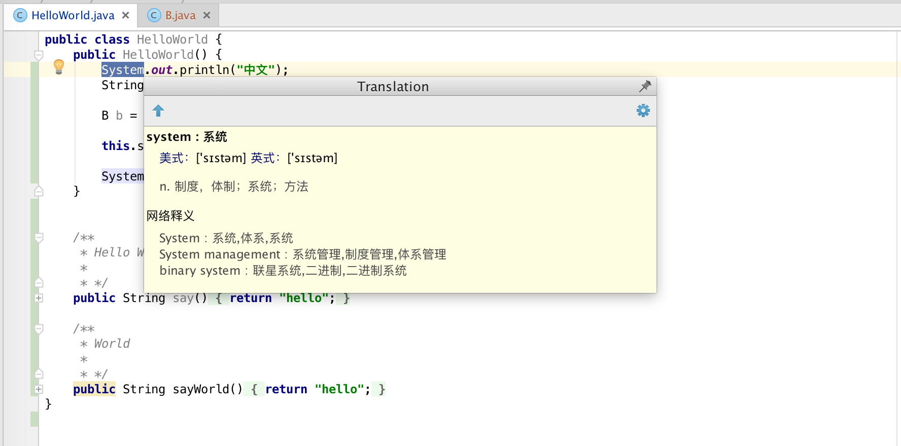
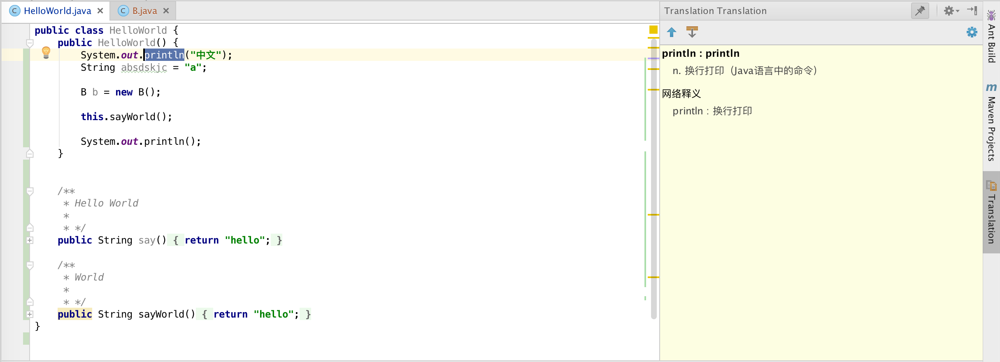
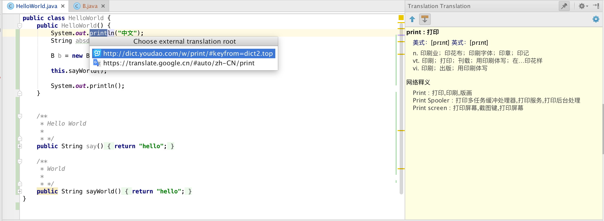
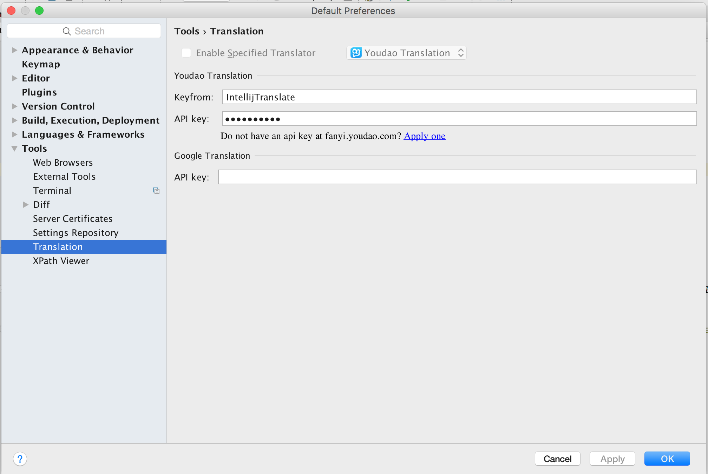

# Intellij Translation

Intellij IDEA 系列编辑器的翻译插件, 目前仅提供 **英文** -> **中文** 翻译.

## Thanks

本插件的原型作品为 [Skykai521/ECTranslation](https://github.com/Skykai521/ECTranslation), 本来想在那基础上提交PR, 后来强迫症发作。

- [有道翻译](http://fanyi.youdao.com/openapi?path=data-mode)
- [简单的Android Studio 翻译插件](http://blog.csdn.net/loucyin/article/details/50983172)

## Installation

* [Intellij Plugins Home](https://plugins.jetbrains.com/plugin/8445) 下载
* 在IDEA编辑器的插件管理,搜索`intellij-translation` 下载. P.S. 可能不支持旧版本编辑器.

## Usage

选中代码, 选择 `View` -> `Quick Translate` 或者使用快捷键 `F10`, 效果如图:

* 悬浮样式

* Tool Windows

* Tool Windows 即时翻译

* `shift + F10` 网页翻译, 提供 **有道** 和 **谷歌翻译**

* 翻译设置

## Todo List

* 提供 Google Translation 翻译, 需要企业版本api key.
